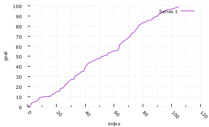
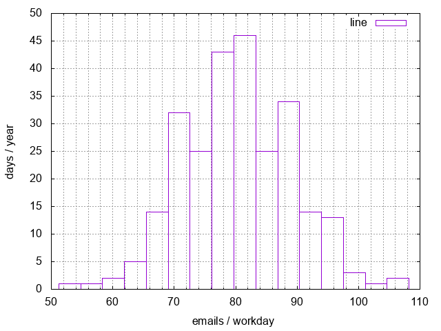
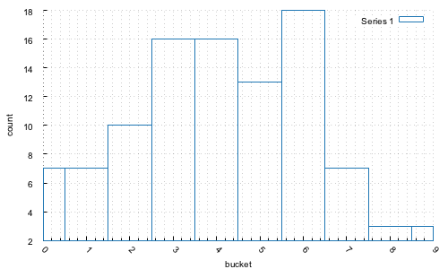
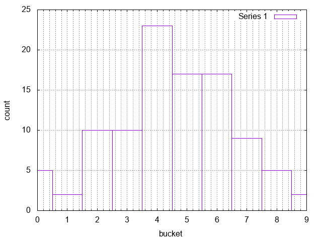
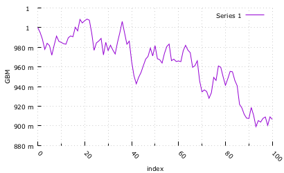
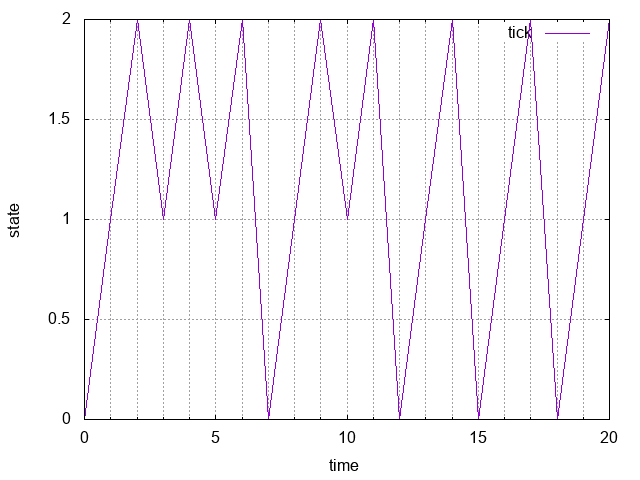
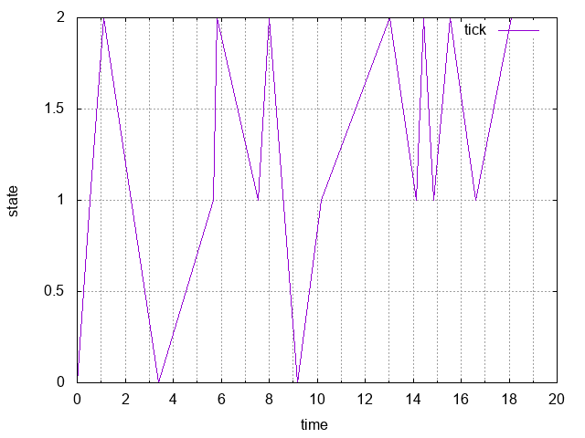

# stochastic

## Install

`npm install @jwalsh/stochastic --save`

## Examples

Real-world examples will be provided from some of the following texts or courses: 

-   18.445 Introduction to Stochastic Processes
-   6.041 / 6.431 Probabilistic Systems Analysis and Applied Probability
-   Introduction to Stochastic Processes, Erhan Cinlar
-   Stochastic Modeling: Analysis & Simulation, Barry L. Nelson
-   Markov Models: An Introduction to Markov Models, Steven Taylor

## Usage

### ES2015

```javascript
import * as stoch from '@jwalsh/stochastic';
const exp = stoch.exp(20);
```

### CommonJS

```javascript
var stoch = require('@jwalsh/stochastic');
var norm = stoch.norm(1, 1, 100);
```

### CDN

```html
<script src="https://cdn.rawgit.com/jwalsh/stochastic/master/dist/bundle.min.js"></script>
<script>
  console.log(stoch.exp(20));
</script>
```

## API

<!-- Generated by documentation.js. Update this documentation by updating the source code. -->

### poissP

Returns an array with the times of each arrival in a [Poisson Process](http://en.wikipedia.org/wiki/Poisson_process) with rate `lambda` until time `T`.


Example: 10 emails per hour during an 8 hour workday; what's the
distribution over the course of a standard 261 work-day year?


**Parameters**

-   `lambda` **[number](https://developer.mozilla.org/en-US/docs/Web/JavaScript/Reference/Global_Objects/Number)** (rate) (optional, default `0`)
-   `T` **[number](https://developer.mozilla.org/en-US/docs/Web/JavaScript/Reference/Global_Objects/Number)** time as positive number (optional, default `0`)
-   `path` **[boolean](https://developer.mozilla.org/en-US/docs/Web/JavaScript/Reference/Global_Objects/Boolean)**  (optional, default `true`)

**Examples**

```javascript
const poissP = stoch.poissP(1, 100, true);
```

Returns **[Array](https://developer.mozilla.org/en-US/docs/Web/JavaScript/Reference/Global_Objects/Array)&lt;[number](https://developer.mozilla.org/en-US/docs/Web/JavaScript/Reference/Global_Objects/Number)>** times of each arrival in a Poisson Process

### average

Returns the average.

**Parameters**

-   `data`  
-   `values` **[Array](https://developer.mozilla.org/en-US/docs/Web/JavaScript/Reference/Global_Objects/Array)&lt;[number](https://developer.mozilla.org/en-US/docs/Web/JavaScript/Reference/Global_Objects/Number)>** 

**Examples**

```javascript
const avg = stoch.average([1, 2, 3]);
```

Returns **[number](https://developer.mozilla.org/en-US/docs/Web/JavaScript/Reference/Global_Objects/Number)** standard deviation as positive number

### std

Returns the standard deviation.

**Parameters**

-   `values` **[Array](https://developer.mozilla.org/en-US/docs/Web/JavaScript/Reference/Global_Objects/Array)&lt;[number](https://developer.mozilla.org/en-US/docs/Web/JavaScript/Reference/Global_Objects/Number)>** 

**Examples**

```javascript
const std = stoch.std([2, 3, 4, 4, 4, 5, 6]);
```

Returns **[number](https://developer.mozilla.org/en-US/docs/Web/JavaScript/Reference/Global_Objects/Number)** standard deviation as positive number

### mock

Returns a mock data set that uses the same standard deviation and average.



**Parameters**

-   `values` **[Array](https://developer.mozilla.org/en-US/docs/Web/JavaScript/Reference/Global_Objects/Array)&lt;[number](https://developer.mozilla.org/en-US/docs/Web/JavaScript/Reference/Global_Objects/Number)>** 

**Examples**

```javascript
const mock = stoch.mock(stoch.norm(1, 1, 100));
```

Returns **[number](https://developer.mozilla.org/en-US/docs/Web/JavaScript/Reference/Global_Objects/Number)** standard deviation as positive number

### norm

Returns an array with `num` normal random variables in a [normal distribution](http://en.wikipedia.org/wiki/Normal_distribution) of mean `mu` and standard deviation `sigma`.



**Parameters**

-   `mu` **[number](https://developer.mozilla.org/en-US/docs/Web/JavaScript/Reference/Global_Objects/Number)** the mean or expectation of the distribution (and also its median and mode) (optional, default `1`)
-   `sigma` **[number](https://developer.mozilla.org/en-US/docs/Web/JavaScript/Reference/Global_Objects/Number)** standard deviation as positive number (optional, default `0`)
-   `num` **[number](https://developer.mozilla.org/en-US/docs/Web/JavaScript/Reference/Global_Objects/Number)** a positive integer (optional, default `1`)

**Examples**

```javascript
const norm = stoch.norm(1, 1, 100);
```

Returns **[Array](https://developer.mozilla.org/en-US/docs/Web/JavaScript/Reference/Global_Objects/Array)&lt;[number](https://developer.mozilla.org/en-US/docs/Web/JavaScript/Reference/Global_Objects/Number)>** normal random values

### brown

Returns an array corresponding to the path of [Brownian motion](http://en.wikipedia.org/wiki/Wiener_process#Related_processes) from time 0 to `T` with drift parameter `mu` and volatility parameter `sigma` (the process is initialized to be 0). The i-th entry in the array corresponds to the Brownian process at time `i * (T / steps)`.


**Parameters**

-   `mu` **[number](https://developer.mozilla.org/en-US/docs/Web/JavaScript/Reference/Global_Objects/Number)** drift parameter (a real number)
-   `sigma` **[number](https://developer.mozilla.org/en-US/docs/Web/JavaScript/Reference/Global_Objects/Number)** volatility parameter (strictly positive real)
-   `T` **[number](https://developer.mozilla.org/en-US/docs/Web/JavaScript/Reference/Global_Objects/Number)** time (strictly positive real)
-   `steps` **[number](https://developer.mozilla.org/en-US/docs/Web/JavaScript/Reference/Global_Objects/Number)** (positive integer)
-   `path` **[boolean](https://developer.mozilla.org/en-US/docs/Web/JavaScript/Reference/Global_Objects/Boolean)**  (optional, default `true`)

**Examples**

```javascript
const brown = stoch.brown(1.0, -0.1, +0.1, 100, true);
```

Returns **[Array](https://developer.mozilla.org/en-US/docs/Web/JavaScript/Reference/Global_Objects/Array)&lt;[number](https://developer.mozilla.org/en-US/docs/Web/JavaScript/Reference/Global_Objects/Number)>** Brownian motion path

### GBM

Returns an array corresponding to the path of [geometric Brownian motion](http://en.wikipedia.org/wiki/Geometric_Brownian_motion) from time 0 to `T` with drift parameter `mu` and volatility parameter `sigma` (the process is initialized to be S0). The i-th entry in the array corresponds to the geometric Brownian process at time `i * (T/steps)`.



**Parameters**

-   `S0` **[number](https://developer.mozilla.org/en-US/docs/Web/JavaScript/Reference/Global_Objects/Number)** initialized process value
-   `mu` **[number](https://developer.mozilla.org/en-US/docs/Web/JavaScript/Reference/Global_Objects/Number)** drift parameter
-   `sigma` **[number](https://developer.mozilla.org/en-US/docs/Web/JavaScript/Reference/Global_Objects/Number)** volatility parameter (strictly positive real)
-   `T` **[number](https://developer.mozilla.org/en-US/docs/Web/JavaScript/Reference/Global_Objects/Number)** time (strictly positive real)
-   `steps` **[number](https://developer.mozilla.org/en-US/docs/Web/JavaScript/Reference/Global_Objects/Number)** (positive integer)
-   `path` **[boolean](https://developer.mozilla.org/en-US/docs/Web/JavaScript/Reference/Global_Objects/Boolean)**  (optional, default `true`)

**Examples**

```javascript
const GBM = stoch.GBM(1.0, -0.1, 0.1, 1.0, 100, true);
```

Returns **[Array](https://developer.mozilla.org/en-US/docs/Web/JavaScript/Reference/Global_Objects/Array)&lt;[number](https://developer.mozilla.org/en-US/docs/Web/JavaScript/Reference/Global_Objects/Number)>** geometric Brownian motion

### DTMC

Returns an array with the states at each step of the [discrete-time Markov Chain](http://en.wikipedia.org/wiki/Markov_chain) given by `transMatrix` (a square matrix). The number of transitions is given by `steps`. The initial state is given by start (the states are indexed from 0 to n-1 where n is the number of arrays in transMatrix).



**Parameters**

-   `transMatrix` **[Array](https://developer.mozilla.org/en-US/docs/Web/JavaScript/Reference/Global_Objects/Array)&lt;[Array](https://developer.mozilla.org/en-US/docs/Web/JavaScript/Reference/Global_Objects/Array)&lt;[number](https://developer.mozilla.org/en-US/docs/Web/JavaScript/Reference/Global_Objects/Number)>>** 
-   `steps` **[number](https://developer.mozilla.org/en-US/docs/Web/JavaScript/Reference/Global_Objects/Number)** (positive integer)
-   `start` **[number](https://developer.mozilla.org/en-US/docs/Web/JavaScript/Reference/Global_Objects/Number)** 
-   `path` **[boolean](https://developer.mozilla.org/en-US/docs/Web/JavaScript/Reference/Global_Objects/Boolean)** 

**Examples**

```javascript
const DTMC = stoch.DTMC([[0,1,0],[0,0,1],[1,0,0]], 20, 0, true);
```

Returns **[Array](https://developer.mozilla.org/en-US/docs/Web/JavaScript/Reference/Global_Objects/Array)&lt;[number](https://developer.mozilla.org/en-US/docs/Web/JavaScript/Reference/Global_Objects/Number)>** 

### collate

Returns the `transMatrix` for an array of mapped `states` to numerical values.

**Parameters**

-   `states` **[Array](https://developer.mozilla.org/en-US/docs/Web/JavaScript/Reference/Global_Objects/Array)&lt;[number](https://developer.mozilla.org/en-US/docs/Web/JavaScript/Reference/Global_Objects/Number)>** 

**Examples**

```javascript
const collate = stoch.collate([0,1,0,0,0,1,1,0,0]);
```

Returns **[Array](https://developer.mozilla.org/en-US/docs/Web/JavaScript/Reference/Global_Objects/Array)&lt;[Array](https://developer.mozilla.org/en-US/docs/Web/JavaScript/Reference/Global_Objects/Array)&lt;[number](https://developer.mozilla.org/en-US/docs/Web/JavaScript/Reference/Global_Objects/Number)>>** transMatrix

### CTMC

Returns an object with the {key:value} pair {time:state} at each step of the [continuous-time Markov Chain](http://en.wikipedia.org/wiki/Continuous-time_Markov_chain) given by transMatrix (a square matrix). The Markov Chain is simulated until time `T`. The initial state is given by `start` (the states are indexed from 0 to n-1 where n is the number of arrays in `transMatrix`).



**Parameters**

-   `transMatrix` **[Array](https://developer.mozilla.org/en-US/docs/Web/JavaScript/Reference/Global_Objects/Array)&lt;[Array](https://developer.mozilla.org/en-US/docs/Web/JavaScript/Reference/Global_Objects/Array)&lt;[number](https://developer.mozilla.org/en-US/docs/Web/JavaScript/Reference/Global_Objects/Number)>>** 
-   `T` **[number](https://developer.mozilla.org/en-US/docs/Web/JavaScript/Reference/Global_Objects/Number)** 
-   `start` **[number](https://developer.mozilla.org/en-US/docs/Web/JavaScript/Reference/Global_Objects/Number)** 
-   `path` **[boolean](https://developer.mozilla.org/en-US/docs/Web/JavaScript/Reference/Global_Objects/Boolean)**  (optional, default `true`)

**Examples**

```javascript
const CTMC = stoch.CTMC([[0,1,0],[0,0,1],[1,0,0]], 20, 0, true);
```

Returns **[Object](https://developer.mozilla.org/en-US/docs/Web/JavaScript/Reference/Global_Objects/Object)** Continuous-time Markov chain

### sample

Generates a random sample (with replacement) from array `arr` of observations. Number of observations `n` is specified by the user.

**Parameters**

-   `arr` **[Array](https://developer.mozilla.org/en-US/docs/Web/JavaScript/Reference/Global_Objects/Array)&lt;[number](https://developer.mozilla.org/en-US/docs/Web/JavaScript/Reference/Global_Objects/Number)>** 
-   `n` **[number](https://developer.mozilla.org/en-US/docs/Web/JavaScript/Reference/Global_Objects/Number)** (positive integer)

**Examples**

```javascript
const sample = stoch.sample([1,2,3,4,5], +10);
```

Returns **[Array](https://developer.mozilla.org/en-US/docs/Web/JavaScript/Reference/Global_Objects/Array)&lt;[number](https://developer.mozilla.org/en-US/docs/Web/JavaScript/Reference/Global_Objects/Number)>** random sample

### exp

Generates an exponential random variable with rate parameter `lambda`.

**Parameters**

-   `lambda` **[number](https://developer.mozilla.org/en-US/docs/Web/JavaScript/Reference/Global_Objects/Number)** (positive) (optional, default `1`)

**Examples**

```javascript
const exp = stoch.exp(20);
```

Returns **[number](https://developer.mozilla.org/en-US/docs/Web/JavaScript/Reference/Global_Objects/Number)** variable

### pareto

Generates a Pareto random variables with parameters `x_m` and `alpha`.

**Parameters**

-   `x_m`  
-   `alpha` **[number](https://developer.mozilla.org/en-US/docs/Web/JavaScript/Reference/Global_Objects/Number)** 
-   `x_a` **[number](https://developer.mozilla.org/en-US/docs/Web/JavaScript/Reference/Global_Objects/Number)** (positive)

**Examples**

```javascript
const pareto = stoch.pareto(+20.0, -1.0);
```

Returns **[number](https://developer.mozilla.org/en-US/docs/Web/JavaScript/Reference/Global_Objects/Number)** distribution

### hist

Generates a histogram object from an array of data. Keys denote the lower bound of each bin and the values indicate the frequency of data in each bin.


**Parameters**

-   `arr` **[Array](https://developer.mozilla.org/en-US/docs/Web/JavaScript/Reference/Global_Objects/Array)&lt;[number](https://developer.mozilla.org/en-US/docs/Web/JavaScript/Reference/Global_Objects/Number)>** 
-   `n`  

**Examples**

```javascript
const hist = stoch.hist([1,1,1,1,2,3,3,4,4,4]);
```

Returns **[Object](https://developer.mozilla.org/en-US/docs/Web/JavaScript/Reference/Global_Objects/Object)** histogram

## Development

Testing is provided with the JavaScript implementation of
<http://clojure.org/guides/spec> in `tests/`.

## License

**The MIT License (MIT)**

> Copyright (c) 2014 Nathan Epstein
>
> Permission is hereby granted, free of charge, to any person obtaining a copy
> of this software and associated documentation files (the "Software"), to deal
> in the Software without restriction, including without limitation the rights
> to use, copy, modify, merge, publish, distribute, sublicense, and/or sell
> copies of the Software, and to permit persons to whom the Software is
> furnished to do so, subject to the following conditions:
>
> The above copyright notice and this permission notice shall be included in
> all copies or substantial portions of the Software.
>
> THE SOFTWARE IS PROVIDED "AS IS", WITHOUT WARRANTY OF ANY KIND, EXPRESS OR
> IMPLIED, INCLUDING BUT NOT LIMITED TO THE WARRANTIES OF MERCHANTABILITY,
> FITNESS FOR A PARTICULAR PURPOSE AND NONINFRINGEMENT. IN NO EVENT SHALL THE
> AUTHORS OR COPYRIGHT HOLDERS BE LIABLE FOR ANY CLAIM, DAMAGES OR OTHER
> LIABILITY, WHETHER IN AN ACTION OF CONTRACT, TORT OR OTHERWISE, ARISING FROM,
> OUT OF OR IN CONNECTION WITH THE SOFTWARE OR THE USE OR OTHER DEALINGS IN
> THE SOFTWARE.
